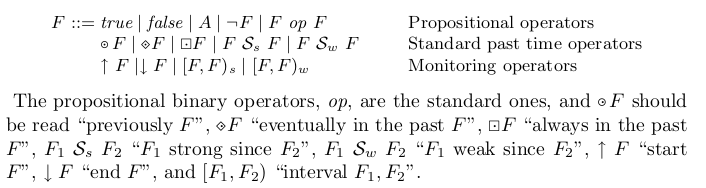

# Pastim-LTL-Runtime-Verification
Pastime LTL for runtime verification

Try [Encoding](https://raw.githubusercontent.com/farif/Pastim-LTL-Runtime-Verification/master/PLTL%2BRV_2_Lustre.lus) in  [Online Kind2](https://kind.cs.uiowa.edu/app/)

## Supported Operators:

References:

1. Havelund, Klaus, and Grigore Roşu. "Synthesizing monitors for safety properties." International Conference on Tools and Algorithms for the Construction and Analysis of Systems. Springer, Berlin, Heidelberg, 2002.
2. Roşu, Grigore, and Klaus Havelund. "Rewriting-based techniques for runtime verification." Automated Software Engineering 12.2 (2005): 151-197.
